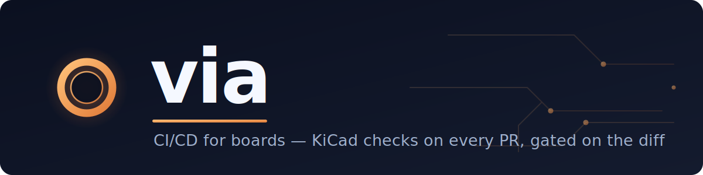

<p align="center">
  
</p>

<p align="center">
  Run <b>via</b> board checks on the KiCad boards changed in a pull request, and gate the merge — as a GitHub check + a PR comment.
</p>

---

Instead of dumping the whole violation list every time, via **diffs the results
against the base branch and tells you what *this change* broke**: new errors
block the merge; the pre-existing warnings you've already decided to live with
stay out of your way. It runs entirely inside your own GitHub Actions — no
account, no upload, **nothing leaves your repo**.

Checks: DRC · connectivity · schematic-parity · ERC · DFM · BOM · cost (per your
repo's `.via-ci.yml`).

## Requirements

A GitHub repo with `.kicad_pcb` files. The KiCad engine (8/9) ships inside the
action image — you don't install anything.

## Usage

```yaml
# .github/workflows/via.yml
name: via board review
on: pull_request
permissions:
  contents: read
  pull-requests: write          # to post the result comment
jobs:
  via:
    runs-on: ubuntu-latest
    steps:
      - uses: actions/checkout@v4
        with: { fetch-depth: 0 }  # base + head both needed for the differential
      - uses: asappcb/via-action@v1
        with:
          parts-csv: parts/jlc.csv   # optional (enables BOM/cost)
```

Open a PR that changes a board and you'll get a comment like:

```
main..fix-power — +3 new (2 error), -1 fixed, 480 unchanged
new errors:
  + [ERR ] unconnected_items: net GND … @ U4
  + [ERR ] clearance: 0.15mm < 0.20mm … @ (61.4, 33.0)
GATE: FAIL — 2 new error(s)
```

## Inputs

| input | default | notes |
|---|---|---|
| `boards` | *(auto)* | glob; empty = the `.kicad_pcb` files changed in the PR |
| `parts-csv` | `''` | JLC/LCSC parts CSV → enables BOM/cost |
| `comment` | `true` | post/update a PR comment |
| `github-token` | `${{ github.token }}` | for the comment; pass a PAT if your org forces the token read-only |

**Output:** `gate` — `pass` | `fail` (whether any board failed its gate). The
job also exits non-zero on failure, so a required check blocks the merge.

## How it works

For each changed `*.kicad_pcb`, it checks **head** (your PR) and **base** (a git
worktree) in **full project context** — your `.kicad_pro` severities, schematic,
and libraries are respected — then runs the differential and gates on *new*
errors. Results always go to the workflow **Job Summary**; a **PR comment** is
posted/updated when the token can write.

> If your org forces the default `GITHUB_TOKEN` to read-only, the comment won't
> post, but the Job Summary and the pass/fail **check status** still work. Pass a
> PAT as `github-token` to get the comment.

## Configuration — `.via-ci.yml`

Put this at your repo root to choose checks and the gate policy. Everything is
optional; an absent file uses these defaults.

```yaml
checks:
  drc: true               # on by default (also yields connectivity + parity)
  connectivity: true      # on by default
  schematic_parity: true  # on by default — board vs schematic drift
  erc: false              # opt-in — needs the sibling .kicad_sch
  dfm:                    # present = on (declared-rule + geometry checks)
    fab: jlcpcb           # fab profile (jlcpcb is the built-in default)
  bom: false              # opt-in, advisory — needs parts data
  cost: false             # opt-in — tracks the bom_cost metric

gate:
  block_on: errors        # errors (default) | any-new | none
  cost_delta_max: 0.50    # optional — block if per-unit cost rises more than this
```

- `drc`, `connectivity`, `schematic_parity` are **on by default**; set `false` to
  suppress a family. They all come from a single DRC pass.
- `erc`, `bom`, `cost` are **off by default** (opt-in).
- `gate.block_on`: `errors` blocks on any **new error**; `any-new` blocks on any
  new finding (incl. warnings); `none` never blocks (report-only).

## The checks

| Check | What it finds |
|---|---|
| **DRC** | design-rule violations (clearance, width, …) |
| **Connectivity** | unconnected items / nets |
| **Schematic parity** | board vs schematic drift (footprint/symbol mismatches) |
| **ERC** | schematic electrical-rule violations (needs the `.kicad_sch`) |
| **DFM — declared** | the board's declared min rules looser than the fab can make |
| **DFM — geometry** | *actual* undersized features: track width, via diameter/drill/annular ring, through-hole pad drill/annular ring |
| **BOM** | components that aren't cleanly orderable (advisory) |
| **Cost** | per-unit cost as a continuous `bom_cost` metric (reports the delta) |

**Geometry-level DFM** measures every feature against the fab profile, so it
catches parts too small to manufacture *even when the board's own DRC passes*
(e.g. a 0.05 mm drill under a 0.2 mm fab minimum). BOM and cost need a JLC/LCSC
parts CSV (`parts-csv`).

## What the differential does

It matches findings between base and head and classifies each as **new**,
**fixed**, or **unchanged** — surviving the churn that would otherwise look like
noise (a component moved, deleted-and-re-added, copy/pasted, or a plugin regen).
Crucially, a new **error** is only ever matched by exact identity, so it can
never be hidden behind a fuzzy match — the gate stays trustworthy. Only new
errors gate by default; warning churn is reported but never blocks.

## Notes

Runs a prebuilt container (`ghcr.io/asappcb/via-action`); the KiCad engine ships
in the image. It's early and under active development — feedback welcome via
issues on this repo.
